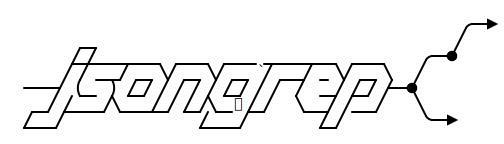
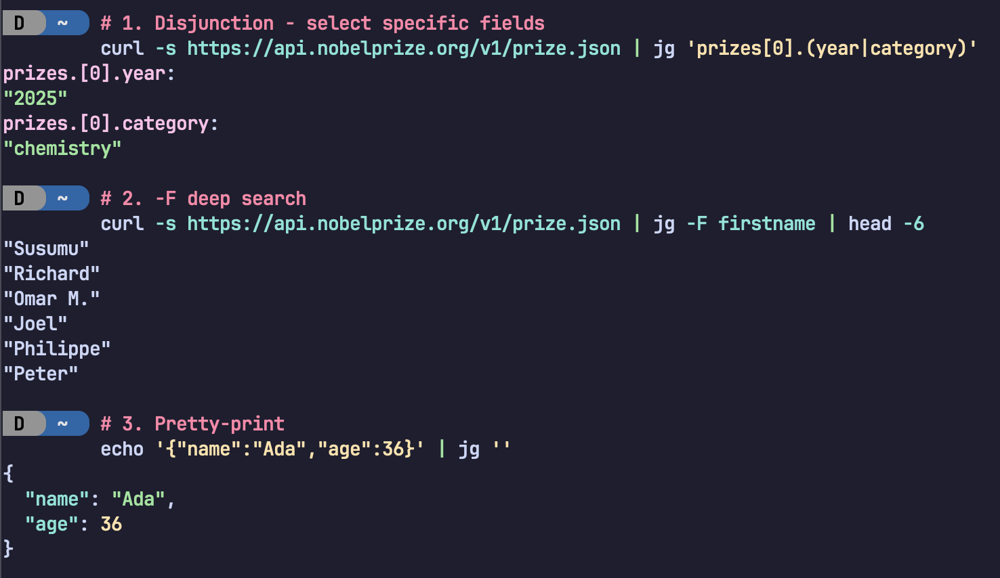

<div align="center">
 
</div>

<p align="center">
<a href="https://github.com/micahkepe/jsongrep/releases"></a>
<a href="https://github.com/micahkepe/jsongrep/blob/main/LICENSE"></a>
<a href="https://github.com/micahkepe/jsongrep/actions"> </a>
</p>

<p align="center">
<code>jsongrep</code> is a command-line tool and Rust library for querying JSON
documents using <strong>regular path expressions</strong>.
</p>

<p align="center">
  
</p>

## Why jsongrep?

JSON documents are trees: objects and arrays branch into nested values, with
edges labeled by field names or array indices. `jsongrep` lets you describe
**sets of paths** through this tree using regular expression operators—the same
way you'd match patterns in text.

```
**.name          # Kleene star: match "name" at any depth
users[*].email   # Wildcard: all emails in the users array
(error|warn).*   # Disjunction: any field under "error" or "warn"
```

This is different from tools like `jq`, which use an imperative filter pipeline.
With `jsongrep`, you declare _what paths to match_, not _how to traverse_. The
query compiles to a
[DFA](https://en.wikipedia.org/wiki/Deterministic_finite_automaton) that
processes the document efficiently.

## Quick Example

```bash
# Extract all names from nested JSON
$ echo '{"users": [{"name": "Alice"}, {"name": "Bob"}]}' | jg 'users.[*].name'
users.[0].name:
"Alice"
users.[1].name:
"Bob"

# Query a file directly
$ jg 'prizes[0].laureates[*].firstname' nobel.json
prizes.[0].laureates.[0].firstname:
"Susumu"
prizes.[0].laureates.[1].firstname:
"Richard"
prizes.[0].laureates.[2].firstname:
"Omar M."
```

## Installation

```bash
cargo install jsongrep
```

The `jg` binary will be installed to `~/.cargo/bin`.

## CLI Usage

```
A JSONPath-inspired query language for JSON documents

Usage: jg [OPTIONS] [QUERY] [FILE] [COMMAND]

Commands:
  generate  Generate additional documentation and/or completions

Arguments:
  [QUERY]  Query string (e.g., "**.name")
  [FILE]   Optional path to JSON file. If omitted, reads from STDIN

Options:
      --compact       Do not pretty-print the JSON output
      --count         Display count of number of matches
      --depth         Display depth of the input document
  -n, --no-display    Do not display matched JSON values
  -F, --fixed-string  Treat the query as a literal field name and search at any depth
  -h, --help          Print help (see more with '--help')
  -V, --version       Print version
```

### More CLI Examples

**Pipe from curl:**

```bash
curl -s https://api.nobelprize.org/v1/prize.json | jg 'prizes[4].laureates[1].motivation'
```

**Count matches without displaying them:**

```bash
jg '**.[*]' data.json --count --no-display
# Found matches: 42
```

## Query Syntax

Queries are **regular expressions over paths**. If you know regex, this will
feel familiar:

| Operator     | Example              | Description                                                   |
| ------------ | -------------------- | ------------------------------------------------------------- |
| Sequence     | `foo.bar.baz`        | **Concatenation**: match path `foo` &rarr; `bar` &rarr; `baz` |
| Disjunction  | `foo \| bar`         | **Union**: match either `foo` or `bar`                        |
| Kleene star  | `**`                 | Match zero or more field accesses                             |
| Repetition   | `foo*`               | Repeat the preceding step zero or more times                  |
| Wildcards    | `*` or `[*]`         | Match any single field or array index                         |
| Optional     | `foo?.bar`           | Continue only if `foo` exists                                 |
| Field access | `foo` or `"foo bar"` | Match a specific field (quote if spaces)                      |
| Array index  | `[0]` or `[1:3]`     | Match specific index or slice                                 |

These queries can be arbitrarily nested as well with parentheses. For example,
`foo.(bar|baz).qux` matches `foo.bar.qux` or `foo.baz.qux`.

This also means you can also recursively descend **any** path with `(* | [*])*`,
e.g., `(* | [*])*.foo` to find all matching paths that have a `foo` field at any
depth.

The query engine compiles expressions to an
[NFA](https://en.wikipedia.org/wiki/Nondeterministic_finite_automaton), then
determinizes to a
[DFA](https://en.wikipedia.org/wiki/Deterministic_finite_automaton) for
execution. See the [grammar](./src/query/grammar) directory and the
[`query`](./src/query) module for implementation details.

> **Experimental:** The grammar supports `/regex/` syntax for matching field
> names by pattern, but this is not yet fully implemented. Determinizing
> overlapping regexes (e.g., `/a/` vs `/aab/`) requires subset construction
> across multiple patterns—planned but not complete.

## Library Usage

Add to your `Cargo.toml`:

```toml
[dependencies]
jsongrep = "0.5"
```

Build queries programmatically:

```rust
use jsongrep::query::engine::QueryBuilder;

// Construct the query "foo[0].bar.*.baz"
let query = QueryBuilder::new()
    .field("foo")
    .index(0)
    .field("bar")
    .field_wildcard()
    .field("baz")
    .build();
```

More examples in the [examples](./examples) directory.

## Shell Completions

Generate completions with `jg generate shell <SHELL>`:

```bash
# Bash
jg generate shell bash > /etc/bash_completion.d/jg.bash

# Zsh
jg generate shell zsh > ~/.zsh/completions/_jg

# Fish
jg generate shell fish > ~/.config/fish/completions/jg.fish
```

## Man Page

```bash
jg generate man -o ~/.local/share/man/man1/
man jg
```

## Contributing

See [CONTRIBUTING.md](CONTRIBUTING.md).

## License

MIT - see [LICENSE.md](LICENSE.md).
