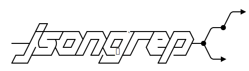
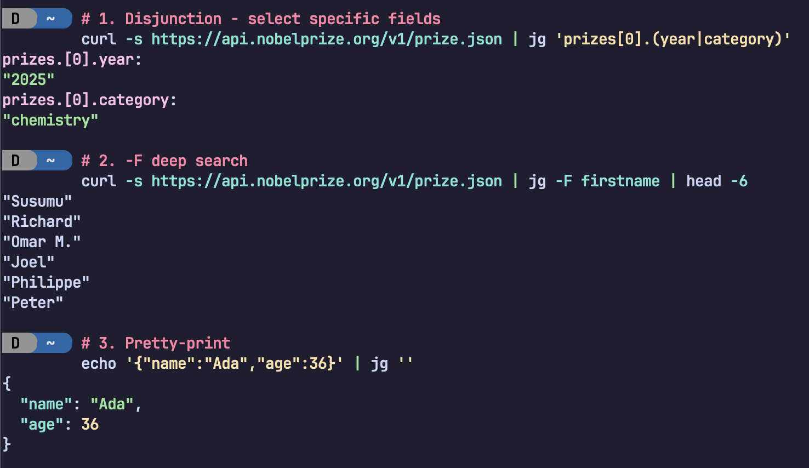
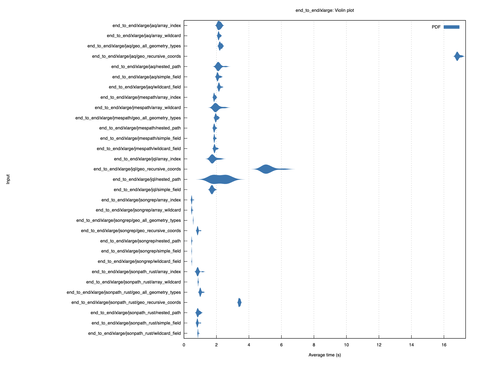

<div align="center">
 
</div>

<p align="center">
<a href="https://crates.io/crates/jsongrep"></a>
<a href="https://github.com/micahkepe/jsongrep/blob/main/LICENSE"></a>
<a href="https://github.com/micahkepe/jsongrep/actions"> </a>
</p>

<p align="center">
<code>jsongrep</code> is a command-line tool and Rust library for
<a href="https://micahkepe.com/jsongrep/end_to_end_xlarge/report/index.html">fast querying</a>
of JSON, YAML, TOML, JSONL, CBOR, and MessagePack documents using <strong>regular path expressions</strong>.
<br>
<a href="https://micahkepe.com/jsongrep/playground/">Try it in your browser</a> · <a href="#installation">Install</a>
</p>

<p align="center">
  
</p>

## Quick Links

- [Installation](#installation)
- [Quick Example](#quick-example)
- [Why jsongrep?](#why-jsongrep)
  - [jsongrep vs jq](#jsongrep-vs-jq)
- [Benchmarks](#benchmarks)
- [Multi\-Format Input](#multi-format-input)
- [CLI Usage](#cli-usage)
  - [More CLI Examples](#more-cli-examples)
- [Query Syntax](#query-syntax)
- [Library Usage](#library-usage)
- [Shell Completions](#shell-completions)
- [Man Pages](#man-pages)
- [Contributing](#contributing)
- [License](#license)

## Installation

<p align="center">
  <a href="https://repology.org/project/jsongrep/versions">
    
  </a>
</p>

**via Homebrew**:

```bash
brew install jsongrep
```

**via Winget**:

```bash
winget install jsongrep
```

**via Scoop**:

```bash
scoop install jsongrep
```

**via `cargo`**:

```bash
cargo install jsongrep
```

## Quick Example

```bash
# Extract all firstnames from the Nobel Prize API
$ curl -s https://api.nobelprize.org/v1/prize.json | jg 'prizes[0].laureates[*].firstname'
prizes.[0].laureates.[0].firstname:
"Susumu"
prizes.[0].laureates.[1].firstname:
"Richard"
prizes.[0].laureates.[2].firstname:
"Omar M."

# Works with inline JSON too
$ echo '{"users": [{"name": "Alice"}, {"name": "Bob"}]}' | jg 'users.[*].name'
users.[0].name:
"Alice"
users.[1].name:
"Bob"
```

## Why jsongrep?

JSON documents are trees: objects and arrays branch into nested values, with
edges labeled by field names or array indices. `jsongrep` lets you describe
**sets of paths** through this tree using regular expression operators - the
same way you'd match patterns in text.

```
**.name          # Kleene star: match "name" under nested objects
users[*].email   # Wildcard: all emails in the users array
(error|warn).*   # Disjunction: any field under "error" or "warn"
(* | [*])*.name  # Any depth: match "name" through both objects and arrays
```

This is different from tools like `jq`, which use a filter pipeline to transform
data. With `jsongrep`, you declare _what paths to match_ rather than describing
_how to transform_. The query compiles to a
[DFA](https://en.wikipedia.org/wiki/Deterministic_finite_automaton) that
processes the document efficiently.

See the [blog post](https://micahkepe.com/blog/jsongrep/) for the motivation
and design behind jsongrep.

### jsongrep vs jq

`jq` is a powerful tool, but its filter syntax can be verbose for common
path-matching tasks. `jsongrep` is declarative: you describe the shape of the
paths you want, and the engine finds them.

**Find a field at any depth:**

```bash
# jsongrep: -F treats the query as a literal field name at any depth
$ curl -s https://api.nobelprize.org/v1/prize.json | jg -F firstname | head -6
prizes.[0].laureates.[0].firstname:
"Susumu"
prizes.[0].laureates.[1].firstname:
"Richard"
prizes.[0].laureates.[2].firstname:
"Omar M."

# jq: requires a recursive descent operator and null suppression
$ curl -s https://api.nobelprize.org/v1/prize.json | jq '.. | .firstname? // empty' | head -3
"Susumu"
"Richard"
"Omar M."
```

`jsongrep` also shows _where_ each match was found (e.g.,
`prizes.[0].laureates.[0].firstname:`), which `jq` does not. _(Examples below
show terminal output; when piped, path headers are hidden by default. See
`--with-path` / `--no-path`.)_

**Select multiple fields at once:**

```bash
# jsongrep: disjunction with (year|category)
$ curl -s https://api.nobelprize.org/v1/prize.json | jg 'prizes[0].(year|category)'
prizes.[0].year:
"2025"
prizes.[0].category:
"chemistry"

# jq: requires listing each field separately
$ curl -s https://api.nobelprize.org/v1/prize.json | jq '.prizes[0] | .year, .category'
"2025"
"chemistry"
```

**Count matches:**

```bash
# jsongrep
$ curl -s https://api.nobelprize.org/v1/prize.json | jg -F firstname --count
Found matches: 1026

# jq
$ curl -s https://api.nobelprize.org/v1/prize.json | jq '[.. | .firstname? // empty] | length'
1026
```

**Pretty-print JSON** (like `jq '.'`):

```bash
$ echo '{"name":"Ada","age":36}' | jg ''
{
  "name": "Ada",
  "age": 36
}
```

## Benchmarks

`jsongrep` is benchmarked against
[jsonpath-rust](https://crates.io/crates/jsonpath-rust),
[jmespath](https://crates.io/crates/jmespath),
[jaq](https://crates.io/crates/jaq-core), and
[jql](https://crates.io/crates/jql-runner) using
[Criterion](https://crates.io/crates/criterion). Four benchmark groups isolate
different costs:

| Group            | What's measured                                   |
| ---------------- | ------------------------------------------------- |
| `document_parse` | JSON string &rarr; in-memory document             |
| `query_compile`  | Query string &rarr; compiled query/DFA/filter     |
| `query_search`   | Search only (pre-parsed doc + pre-compiled query) |
| `end_to_end`     | Full pipeline: parse + compile + search           |

Test data ranges from a small sample JSON to a 190 MB GeoJSON file
([citylots.json](https://github.com/zemirco/sf-city-lots-json)), with queries
chosen to exercise equivalent functionality across tools (recursive descent,
wildcards, nested paths). Where a tool lacks a feature, the benchmark is
skipped rather than faked.

**End-to-end on 190 MB GeoJSON (xlarge):**

<p align="center">
  
</p>

[Interactive Criterion reports](https://micahkepe.com/jsongrep/report/index.html)
&nbsp;|&nbsp; [Benchmark source and methodology](./benches/README.md)

## Multi-Format Input

`jg` natively supports multiple serialization formats. Non-JSON formats are
converted to JSON at the boundary, then queried with the same engine, so your
queries work identically regardless of input format.

**Query your Cargo.toml:**

```bash
$ jg 'dependencies.*.version' Cargo.toml
dependencies.clap.version:
"4.5.43"
dependencies.serde.version:
"1.0.219"
...
```

**Query a docker-compose.yml:**

```bash
$ jg 'services.*.image' docker-compose.yml
services.web.image:
"nginx:latest"
services.db.image:
"postgres:16"
```

**JSONL/NDJSON**: each line becomes an array element:

```bash
$ jg '[*].email' users.jsonl
[0].email:
"alice@example.com"
[1].email:
"bob@example.com"
```

**Explicit format flag** (useful for stdin or non-standard extensions):

```bash
$ cat config.yaml | jg -f yaml 'database.host'
database.host:
"localhost"
```

**Binary formats** (CBOR, MessagePack):

```bash
$ jg 'name' data.cbor
$ jg -f msgpack 'name' data.bin
```

| Format       | Extensions          | Feature flag | Notes                   |
| ------------ | ------------------- | ------------ | ----------------------- |
| JSON         | `.json` (default)   | —            | Always available        |
| JSONL/NDJSON | `.jsonl`, `.ndjson` | —            | Wrapped into JSON array |
| YAML         | `.yaml`, `.yml`     | `yaml`       | Included by default     |
| TOML         | `.toml`             | `toml`       | Included by default     |
| CBOR         | `.cbor`             | `cbor`       | Included by default     |
| MessagePack  | `.msgpack`, `.mp`   | `msgpack`    | Included by default     |

All format dependencies are included by default. To build without them:

```bash
cargo install jsongrep --no-default-features
```

## CLI Usage

```
JSONPath-inspired query language for JSON, YAML, TOML, and other serialization formats

Usage: jg [OPTIONS] [QUERY] [FILE] [COMMAND]

Commands:
  generate  Generate additional documentation and/or completions

Arguments:
  [QUERY]  Query string (e.g., "**.name")
  [FILE]   Optional path to file. If omitted, reads from STDIN

Options:
  -i, --ignore-case      Case insensitive search
      --compact          Do not pretty-print the JSON output
      --count            Display count of number of matches
      --depth            Display depth of the input document
      --porcelain        Machine-readable output: strip labels and colors (useful for piping)
  -n, --no-display       Do not display matched JSON values
  -F, --fixed-string     Treat the query as a literal field name and search at any depth
      --with-path        Always print the path header, even when output is piped
      --no-path          Never print the path header, even in a terminal
  -f, --format <FORMAT>  Input format (auto-detects from file extension if omitted) [default: auto] [possible values: auto, json, jsonl, yaml, toml, cbor, msgpack]
  -h, --help             Print help (see more with '--help')
  -V, --version          Print version
```

### More CLI Examples

**Search for a literal field name at any depth:**

```bash
curl -s https://api.nobelprize.org/v1/prize.json | jg -F motivation | head -4
```

**Count matches without displaying them:**

```bash
curl -s https://api.nobelprize.org/v1/prize.json | jg -F firstname --count
# Found matches: 1026
```

**Piping to other tools:**

By default, path headers display in terminals and hide when output is piped
(like ripgrep's `--heading`). This makes piping to `sort`, `uniq`, etc., work
cleanly:

```bash
# Piped: values only, ready for sort/uniq/wc
$ curl -s https://api.nobelprize.org/v1/prize.json | jg -F firstname | sort | head -3
"A. Michael"
"Aage N."
"Aaron"

# Force path headers when piped
$ curl -s https://api.nobelprize.org/v1/prize.json | jg -F firstname --with-path | head -4
prizes.[0].laureates.[0].firstname:
"Susumu"
prizes.[0].laureates.[1].firstname:
"Richard"
```

## Query Syntax

Queries are **regular expressions over paths**. If you know regex, this will
feel familiar:

| Operator     | Example              | Description                                                   |
| ------------ | -------------------- | ------------------------------------------------------------- |
| Sequence     | `foo.bar.baz`        | **Concatenation**: match path `foo` &rarr; `bar` &rarr; `baz` |
| Disjunction  | `foo \| bar`         | **Union**: match either `foo` or `bar`                        |
| Kleene star  | `**`                 | Match zero or more field accesses                             |
| Repetition   | `foo*`               | Repeat the preceding step zero or more times                  |
| Wildcards    | `*` or `[*]`         | Match any single field or array index                         |
| Optional     | `foo?.bar`           | Optional `foo` field access                                   |
| Field access | `foo` or `"foo bar"` | Match a specific field (quote if spaces)                      |
| Array index  | `[0]` or `[1:3]`     | Match specific index or slice (exclusive end)                 |

These queries can be arbitrarily nested with parentheses. For example,
`foo.(bar|baz).qux` matches `foo.bar.qux` or `foo.baz.qux`.

This also means that you can recursively descend **any** path with `(* | [*])*`,
e.g., `(* | [*])*.foo` to find all paths matching `foo` field at any
depth.

The query engine compiles expressions to an
[NFA](https://en.wikipedia.org/wiki/Nondeterministic_finite_automaton), then
determinizes to a
[DFA](https://en.wikipedia.org/wiki/Deterministic_finite_automaton) for
execution. See the [grammar](./src/query/grammar) directory and the
[`query`](./src/query) module for implementation details.

> **Experimental:** The grammar supports `/regex/` syntax for matching field
> names by pattern, but this is not yet fully implemented. Determinizing
> overlapping regexes (e.g., `/a/` vs `/aab/`) requires subset construction
> across multiple patterns - planned but not complete.

## Library Usage

Add to your `Cargo.toml`:

```toml
[dependencies]
jsongrep = "0.8.1"
```

Query with a one-liner:

```rust
let json: jsongrep::Value = serde_json::from_str(r#"{"users": [{"name": "Alice"}]}"#)?;
let results = jsongrep::grep(&json, "users[*].name")?;

for result in &results {
    println!("{:?}: {}", result.path, result.value);
}
```

For repeated queries, compile the DFA once and reuse it:

```rust
use jsongrep::query::QueryDFA;

let dfa = QueryDFA::from_query_str("users[*].name")?;
let results = dfa.find(&json);
```

Build queries programmatically with `QueryBuilder`:

```rust
use jsongrep::query::{QueryBuilder, QueryDFA};

let query = QueryBuilder::new()
    .field("users")
    .array_wildcard()
    .field("name")
    .build();

let dfa = QueryDFA::from_query(&query);
let results = dfa.find(&json);
```

More examples in the [examples](./examples) directory.

## Shell Completions

> [!NOTE]
> Installed automatically with most package managers.

Generate completions with `jg generate shell <SHELL>`:

```bash
# Bash
jg generate shell bash > /etc/bash_completion.d/jg.bash

# Zsh
jg generate shell zsh > ~/.zsh/completions/_jg

# Fish
jg generate shell fish > ~/.config/fish/completions/jg.fish
```

## Man Pages

> [!NOTE]
> Installed automatically with most package managers.

```bash
jg generate man -o ~/.local/share/man/man1/
man jg
```

## Contributing

See [CONTRIBUTING.md](CONTRIBUTING.md).

## License

MIT - see [LICENSE.md](LICENSE.md).
